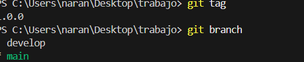
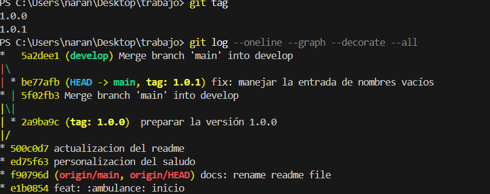

# Proyecto Git Flow

Proyecto simple en Python para demostrar el flujo Git Flow con Conventional Commits.

## Descripción
El programa solicita el nombre del usuario y muestra un saludo personalizado.

## Versión
Release inicial 1.0.0

## version 
Release  1.0.1

